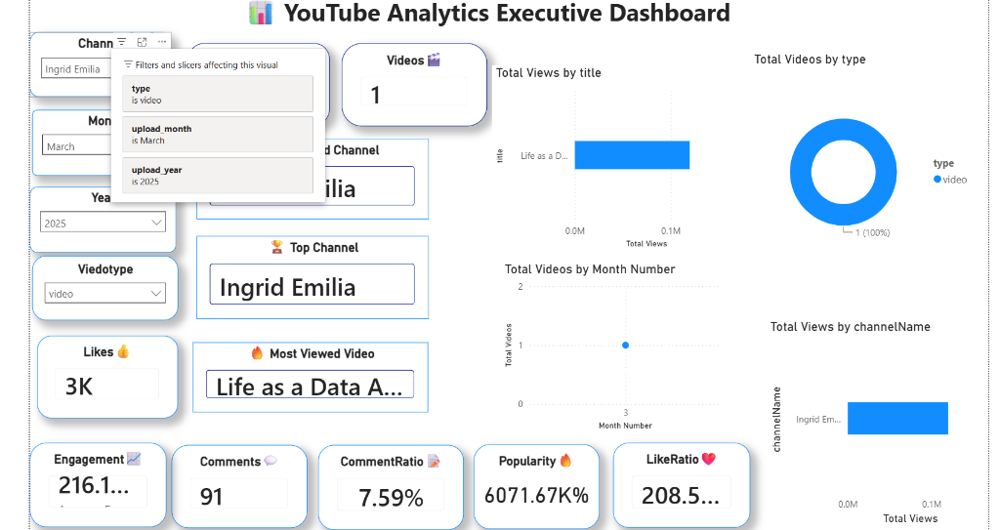

# YouTube Data Analysis Project

This project conducts an end-to-end data analysis of YouTube video data, from data collection and cleaning to exploratory data analysis (EDA), SQL querying, and visualization using Power BI.

## Dashboard Preview



## Project Structure

The repository is organized as follows:
- **`data/`**: Contains raw, cleaned, and processed datasets in CSV format.
  - `raw/youtube.raw.csv`: The initial scraped/collected data.
  - `cleaned/youtube_cleaned.csv`: Cleaned data with normalized formats.
  - `processed/youtube_final.csv`: Final dataset enriched with features (e.g., engagement rates, popularity scores).
- **`notebooks/`**: Jupyter notebooks containing the main Python code.
  - `data collection.ipynb`: Script/notebook used to collect video statistics.
  - `eda.ipynb`: Exploratory data analysis, visualization, and feature engineering.
- **`sql/`**: SQL scripts for deeper data querying.
  - `yutube_sql.sql`: SQL schema creation and analytics queries (views, likes, comments, engagement rate, hourly/monthly trends).
- **`powerbi/`**: Power BI reports.
  - `dax.pbix`: Interactive dashboard visualizing the analysis and key metrics.

## Key Analytics & Features
- **Engagement Rate Analysis**: Calculated based on views, likes, and comments.
- **Popularity Score**: Custom metric combining views and engagement metrics.
- **Upload Trends**: Analysis of views and video count by upload hour, day, month, and year.
- **Top Channels & Videos**: Rankings of channels and individual videos by popularity and engagement.

## Getting Started

### Prerequisites
- Python 3.x
- Jupyter Notebook / JupyterLab
- MySQL / PostgreSQL (for running SQL queries)
- Power BI Desktop (to view the dashboard)

### Setup
1. Clone the repository:
   ```bash
   git clone <repository-url>
   ```
2. Explore Jupyter Notebooks in the `notebooks/` directory.
3. Import the dataset in `data/processed/youtube_final.csv` to your SQL database and run queries from `sql/yutube_sql.sql`.
4. Open the Power BI dashboard in `powerbi/dax.pbix` to view visual insights.
